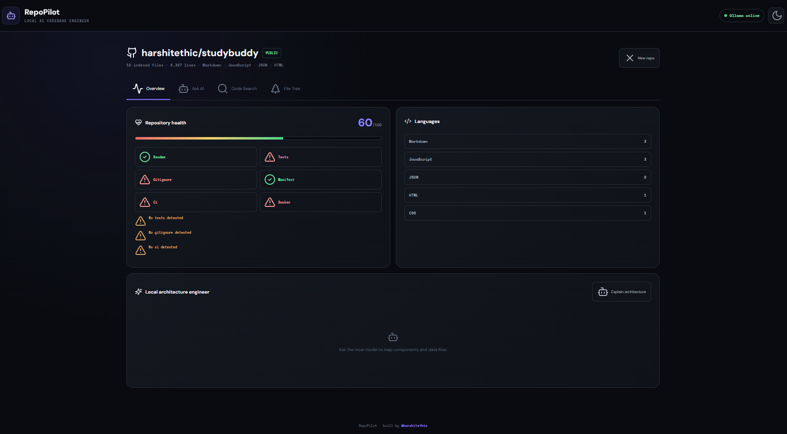
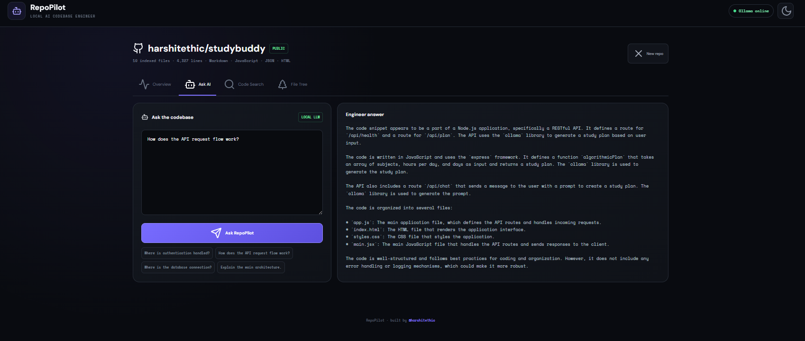
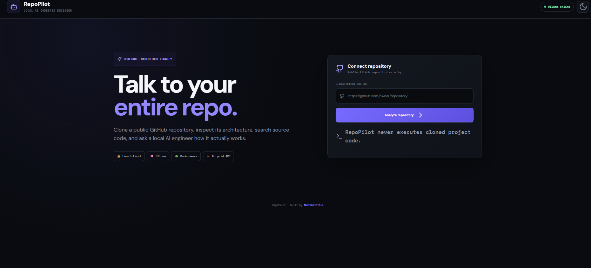
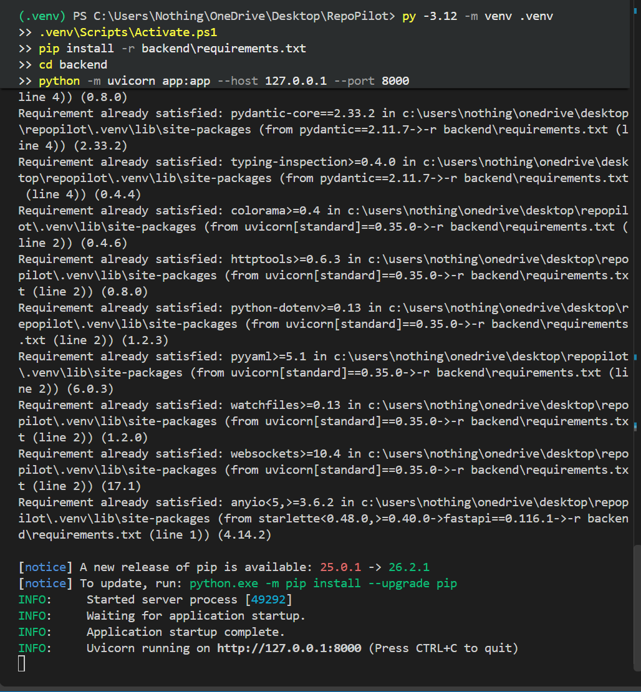
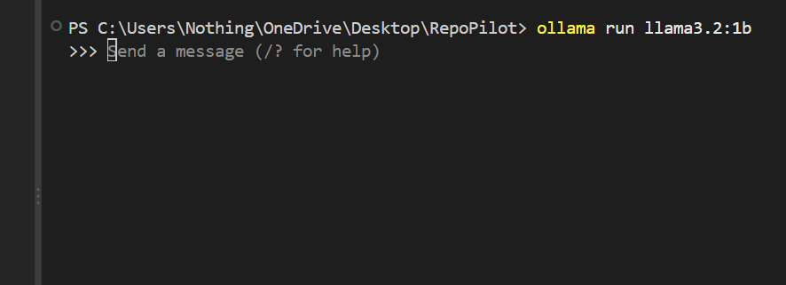
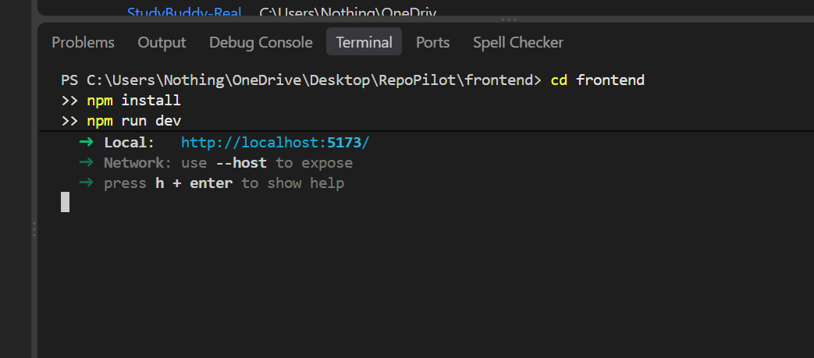

# 🧠 RepoPilot — Local AI Codebase Engineer

> **A cartoonish, student-friendly local AI developer tool built by [@harshitethic](https://github.com/harshitethic) for his college bhais ❤️**

RepoPilot lets you paste a **public GitHub repository**, clone it locally, inspect its structure, search its source code, calculate transparent project-health signals, and ask a local AI engineer questions about how the codebase works.

**No OpenAI. No Gemini. No paid API keys.**

Everything important runs locally with **Git + FastAPI + React + Ollama**.

---

## ✨ What RepoPilot does

```text
GitHub Repository
       ↓
   Git Clone
       ↓
 Source Indexer
   ↙    ↓     ↘
Search  Health  File Tree
       ↓
Relevant Code Context
       ↓
Ollama + Local LLM
       ↓
Developer Answer
```

### Main features

- 🔗 **GitHub repository cloning**
- 🌳 **Interactive file tree**
- 🔎 **Real source-code search**
- 🧠 **Ask AI about the codebase**
- 🏗️ **Architecture explanation**
- ❤️ **Repository health score**
- 📊 **Language and code statistics**
- 🔒 **Local-first AI**
- 🚫 **No paid AI API**
- 🛡️ **Does not execute cloned repository code**
- 🌙 **Dark mode**
- 🎨 **Cartoonish / meme-ish student UI**

---

# 🖼️ Screenshots

## Dashboard



## Repository Analysis



## Ask AI



## Code Search



## Architecture



## File Tree



---

# 🤖 Local AI

RepoPilot uses **Ollama** instead of a paid cloud AI API.

Recommended starter model:

```text
llama3.2:1b
```

Install it:

```powershell
ollama pull llama3.2:1b
```

Run it:

```powershell
ollama run llama3.2:1b
```

You can also change the model through the `OLLAMA_MODEL` environment variable.

For example:

```powershell
$env:OLLAMA_MODEL="llama3.2:3b"
```

A larger model can provide better explanations if your machine has enough RAM.

---

# 🛠️ Tech Stack

| Layer | Technology |
|---|---|
| Frontend | React |
| Build tool | Vite |
| Backend | FastAPI |
| Language | Python |
| Local AI | Ollama |
| LLM | Llama 3.2 |
| Git operations | Git CLI |
| HTTP | REST API |
| Styling | Custom CSS |
| Icons | Lucide React |

---

# 💻 Requirements

Recommended:

- Windows / macOS / Linux
- Python **3.12**
- Node.js **18+**
- Git
- Ollama
- 8 GB RAM recommended
- Internet connection for cloning public GitHub repositories

Python 3.12 is recommended for a predictable backend setup.

---

# 🚀 Installation

## 1. Clone RepoPilot

```powershell
git clone https://github.com/harshitethic/RepoPilot.git
cd RepoPilot
```

---

# 🧠 2. Install Ollama

Install Ollama, then:

```powershell
ollama pull llama3.2:1b
```

Test it:

```powershell
ollama run llama3.2:1b
```

Keep Ollama running.

---

# 🐍 3. Backend

Create a Python environment:

```powershell
py -3.12 -m venv .venv
```

Activate it:

```powershell
.venv\Scripts\Activate.ps1
```

Upgrade pip:

```powershell
python -m pip install --upgrade pip
```

Install dependencies:

```powershell
pip install -r backend
equirements.txt
```

Start FastAPI:

```powershell
cd backend
python -m uvicorn app:app --host 127.0.0.1 --port 8000
```

You should see:

```text
Uvicorn running on http://127.0.0.1:8000
```

Keep this terminal open.

---

# 🌐 4. Frontend

Open another terminal:

```powershell
cd frontend
npm install
npm run dev
```

Open:

```text
http://localhost:5173
```

---

# 🧩 Recommended 3-terminal setup

### Terminal 1 — Ollama

```powershell
ollama run llama3.2:1b
```

### Terminal 2 — Backend

```powershell
.venv\Scripts\Activate.ps1
cd backend
python -m uvicorn app:app --host 127.0.0.1 --port 8000
```

### Terminal 3 — Frontend

```powershell
cd frontend
npm install
npm run dev
```

Then visit:

```text
http://localhost:5173
```

---

# 🧪 Try it

Paste a public GitHub repository such as:

```text
https://github.com/fastapi/fastapi
```

Then click:

**Analyze repository**

After indexing, try:

### Ask AI

```text
Where is the main application entry point?
```

```text
How does the API request flow work?
```

```text
Where is authentication handled?
```

```text
Where is the database connection created?
```

### Code Search

Search for:

```text
router
```

or:

```text
authentication
```

or:

```text
FastAPI
```

### Architecture

Click:

**Explain architecture**

RepoPilot will send relevant repository context to the local Ollama model and generate an explanation.

---

# ❤️ Repository Health

RepoPilot intentionally uses a **transparent heuristic** instead of pretending an AI-generated number is an objective engineering metric.

It checks signals such as:

- README
- Tests
- `.gitignore`
- Package/dependency manifest
- GitHub Actions / CI
- Docker configuration
- Source files
- Project size

For example:

```text
Repository Health

60 / 100

✓ README
✓ Package / Manifest
✗ Tests
⚠ .gitignore
✗ CI / CD Workflow
✗ Docker Support
```

The score is **not a security audit**.

It is simply a quick project-quality signal.

---

# 🔒 Security & privacy

RepoPilot is deliberately conservative.

### It does:

- Clone public GitHub repositories
- Read source/documentation files
- Search source code
- Send selected code context to your **local** Ollama server

### It does NOT:

- Execute cloned repository code
- Run `npm install` inside the cloned repository
- Run arbitrary repository scripts
- Require OpenAI/Gemini API keys
- Upload your repository to a cloud AI service

The local clone directory is ignored by Git:

```text
backend/repos/
```

---

# 📁 Project Structure

```text
RepoPilot/
│
├── backend/
│   ├── app.py
│   ├── requirements.txt
│   │
│   ├── repos/
│   │
│   └── services/
│       ├── analyzer.py
│       ├── github.py
│       └── ollama.py
│
├── frontend/
│   ├── package.json
│   ├── vite.config.js
│   │
│   └── src/
│       ├── main.jsx
│       └── styles.css
│
├── screenshots/
│   ├── dashboard.png
│   ├── repository-analysis.png
│   ├── ask-ai.png
│   ├── code-search.png
│   ├── architecture.png
│   └── file-tree.png
│
├── .gitignore
└── README.md
```

---

# 🔌 API

The FastAPI backend exposes:

```text
GET  /api/health
POST /api/analyze
POST /api/search
POST /api/ask
POST /api/architecture
```

### Health

```text
GET /api/health
```

Checks whether Ollama is reachable and reports available models.

### Analyze

```text
POST /api/analyze
```

Clones and indexes a public GitHub repository.

### Search

```text
POST /api/search
```

Searches indexed source files.

### Ask

```text
POST /api/ask
```

Builds relevant code context and asks the local LLM.

### Architecture

```text
POST /api/architecture
```

Generates an architecture explanation using repository context.

---

# 🧠 Why this is a good college project

RepoPilot combines several real engineering concepts in one application:

```text
React
  +
FastAPI
  +
Git
  +
Code indexing
  +
Search
  +
Local LLM
  +
REST APIs
  +
Repository analysis
```

It is also easy to demonstrate in a viva:

> **"Give me a GitHub repository and I can locally clone it, inspect it, search its code, analyze project health, and ask an open-source local LLM questions about its architecture."**

That's a much better demonstration than a static AI chatbot.

---

# 🚧 Current limitations

This version intentionally supports **public GitHub repositories only**.

It does not currently:

- Analyze private repositories
- Execute project code
- Build dependency graphs
- Parse every programming language with a full AST
- Perform a real security audit
- Guarantee that the LLM's explanation is correct

The AI is only as reliable as the repository context and local model.

---

# 🔮 Future ideas

Possible upgrades:

- [ ] ZIP repository upload
- [ ] Private GitHub OAuth
- [ ] GitHub App integration
- [ ] AST-based code analysis
- [ ] Dependency graph visualization
- [ ] Call graph visualization
- [ ] Git commit history analysis
- [ ] Security smell detection
- [ ] Automatic README generation
- [ ] Local embeddings / RAG
- [ ] Multiple Ollama models
- [ ] Export architecture report as PDF
- [ ] Repository comparison
- [ ] Code-quality trends

---

# 👨‍💻 Built by

## **@harshitethic**

Built by **[@harshitethic](https://github.com/harshitethic)**

### ❤️ For his college bhais

Made for students who want to build, understand, customize, and actually explain their projects in the viva.

No fake demo.

No:

```text
"Please enter your OpenAI API key"
```

Just clone it, run it, understand it, and make it better. 🚀

---

# ⭐ If you found it useful

Star the repository ⭐

Fork it 🍴

Break it 💀

Fix it 🔧

And most importantly:

**Understand your code before your viva. 😭**

---

## License

MIT License.
